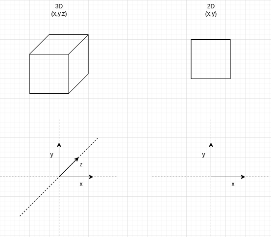
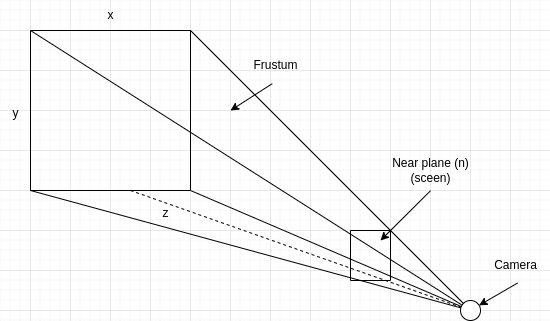
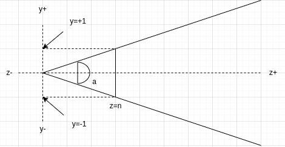

# FDF for 42

> :warning: **Project has not been tested yet.** :warning:

## What is it?

FDF ("File de fer" in french) is about representing a landscape as a 3D object in which all surfaces are outlined in lines.

#TODO: image of final progam

## Trigonometry

The FDF project involves utilizing trigonometric functions to transform 2D points into a 3D representation, creating a visually appealing landscape. Understanding trigonometry is crucial for manipulating angles and distances to accurately position points in the 3D space.

#TODO



#TODO



#TODO



## Usage

To use the FDF program, follow these steps:

1. Clone the repository:
   ```bash
   git clone https://github.com/CleSucre/fdf.git
   ```

2. Navigate to the project directory:
   ```bash
   cd fdf
   ```

3. Build the executable:
   ```bash
   make
   ```

4. Run the program with a provided map file:
   ```bash
   ./fdf test_maps/42.fdf
   ```

## Map Files

The FDF program requires map files that define the landscape. These files contain a grid of integer values, where each value represents the height of a point on the grid. Exemple files are provided in the `test_maps` directory.

:warning: **Note: This project is currently under development and has not been thoroughly tested. Use at your own risk.** :warning: